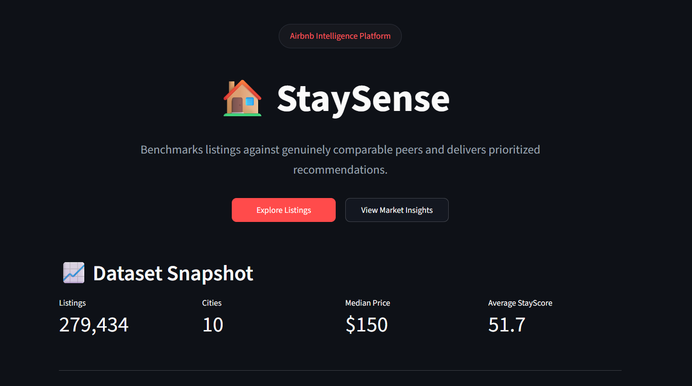
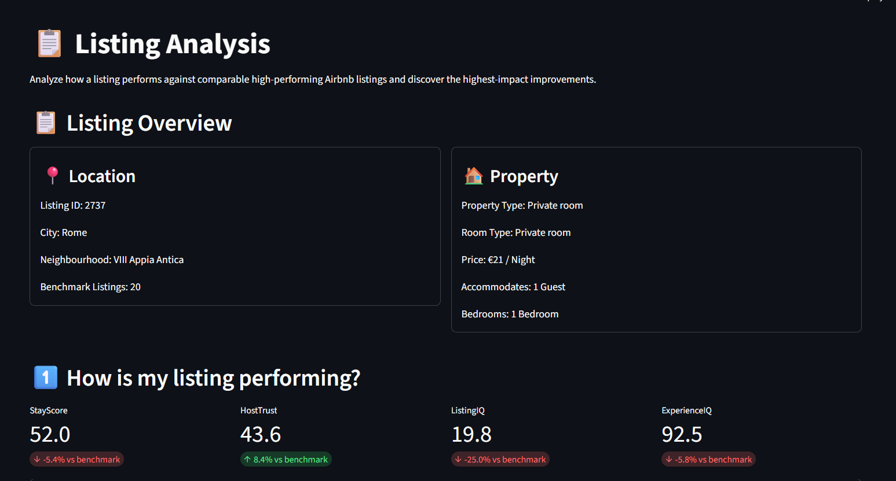
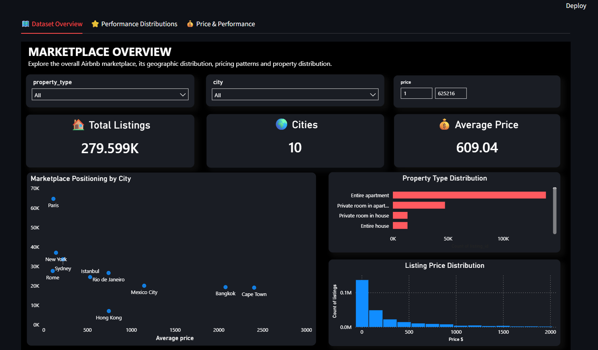
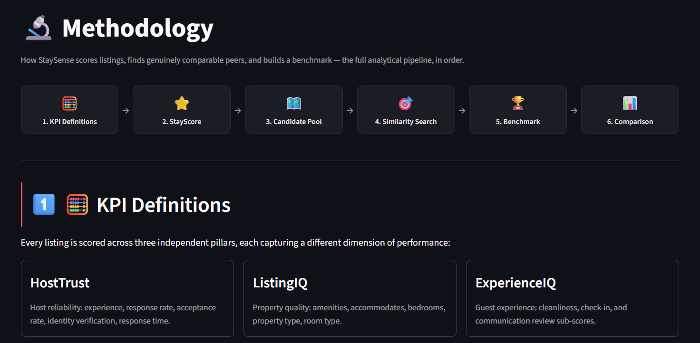

# 🏠 StaySense

### Airbnb Listing Intelligence Platform

**StaySense** is an end-to-end Airbnb analytics platform that benchmarks Airbnb listings against genuinely comparable peers using custom performance metrics, intelligent benchmarking, machine learning, and interactive Power BI dashboards.

---

## 📸 Application Preview

### 🏠 Home



### 📋 Listing Analysis



### 📊 Market Insights



### 📖 Methodology



---

# 📖 Overview

Traditional Airbnb analytics often compare listings against broad market averages, producing misleading insights.

StaySense solves this problem by benchmarking every listing against genuinely comparable properties using hierarchical filtering, K-Nearest Neighbors (KNN) similarity search, and custom performance KPIs. The platform enables hosts and analysts to identify performance gaps and discover actionable recommendations through an interactive analytics dashboard.

---

# ✨ Features

- **Listing Analysis** – Benchmark an Airbnb listing against comparable high-performing properties.
- **Market Insights** – Interactive Power BI dashboards for market-wide analysis.
- **Custom KPIs** – StayScore, HostTrust, ListingIQ, and ExperienceIQ.
- **Machine Learning** – K-Nearest Neighbors similarity search, Random Forest modeling, and Permutation Importance analysis.
- **Methodology** – Transparent end-to-end benchmarking pipeline.
- **Business Insights** – Marketplace trends, pricing analysis, and performance benchmarking.

---

# 🏆 Custom KPIs

## ⭐ StayScore

A composite performance score that combines multiple aspects of an Airbnb listing—including host reliability, listing quality, guest experience, and pricing competitiveness—to provide an overall measure of listing performance.

## 🤝 HostTrust

Measures host reliability using attributes such as response rate, response time, acceptance rate, Superhost status, and review history.

## 🏡 ListingIQ

Evaluates the overall quality and competitiveness of a listing using factors such as amenities, property characteristics, listing completeness, and pricing.

## 😊 ExperienceIQ

Captures the expected guest experience by combining guest review metrics including cleanliness, communication, location, value, and overall satisfaction.

---

# ⚙️ Project Workflow

```text
Raw Airbnb Dataset
        │
        ▼
Data Cleaning
        │
        ▼
Feature Engineering
        │
        ▼
Machine Learning
(KNN • Random Forest • Permutation Importance)      
        │
        ▼
Custom KPI Engineering
        │
        ▼
Benchmark Generation
        │
        ├────────► Power BI Dashboard
        │
        └────────► Streamlit Application
```

---

# 💻 Tech Stack

### Programming & Analytics

- Python
- Pandas
- NumPy
- Scikit-learn
- Plotly

### Data Visualization

- Power BI
- DAX
- Streamlit
- Matplotlib
- Seaborn

### Development Tools

- Git
- GitHub
- Jupyter Notebook

---

# 📂 Project Structure

```text
StaySense/
│
├── Dashboard/
│
├── Data/
│
├── Images/
│
├── Notebooks/
│
├── Src/
│
├── README.md
├── requirements.txt
└── .gitignore
```


# 👨‍💻 Author

**Parv Gupta**

- GitHub: https://github.com/parvgupta22
- LinkedIn: https://www.linkedin.com/in/parv-gupta-00b340250/